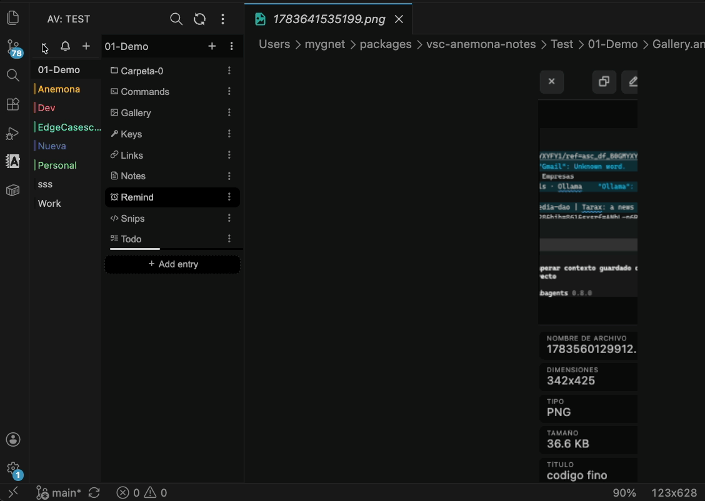
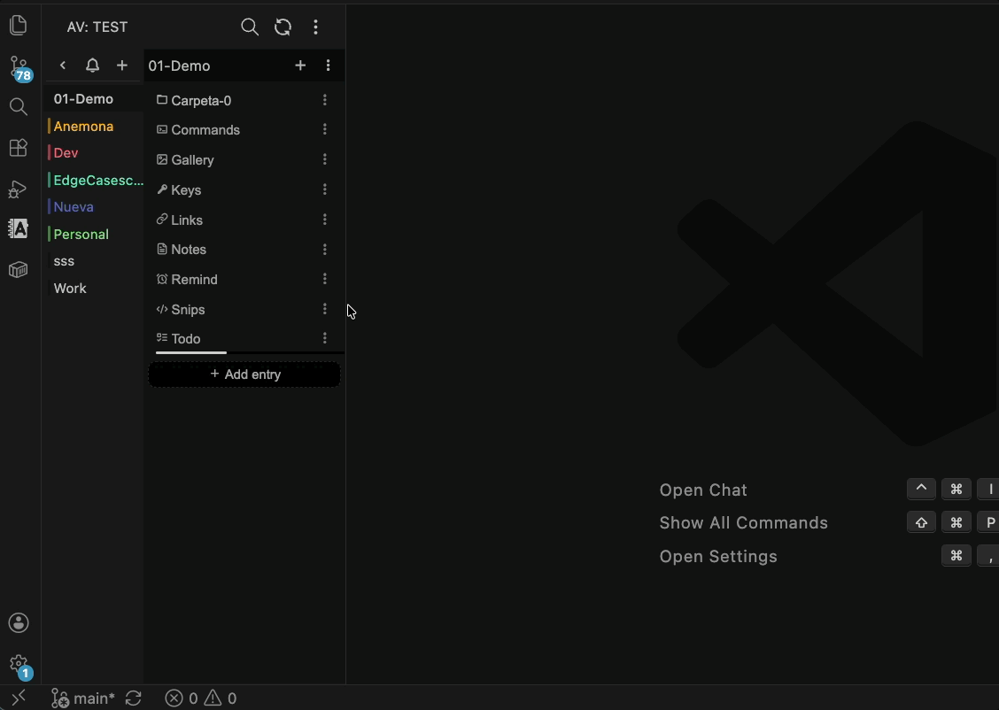

# Anémona Vault

Tu espacio de trabajo dentro de Visual Studio Code.

Organizá todo lo que usás a diario en un solo lugar — notas, secretos, recordatorios, tareas, comandos y fragmentos de código — todo accesible desde un panel lateral dedicado.

> 🌍 Español & English — internacionalización completa con detección automática desde VS Code.
> Selector de idioma en el menú de acciones.


## Funcionalidades

### Tipos de nota

| Tipo | Extensión | Icono | Descripción |
|------|-----------|-------|-------------|
| Texto | `.md` | 📄 | Notas markdown con búsqueda |
| Clave | `.anemona-key` / `.anemona-lock` | 🔑 / 🔒 | Secretos cifrados, contraseñas, tokens API |
| Comando | `.anemona-command` | ⌘ | Comandos reutilizables con copia y documentación opcional |
| Enlace | `.anemona-link` | 🔗 | Gestor de marcadores con verificación de estado, favicon y auto-completado |
| Tarea | `.anemona-todo` | ☑️ | Seguimiento de tareas con progreso, prioridad y fechas |
| Fragmento | `.anemona-snippet` | 📋 | Fragmentos de código con lenguaje y copia |
| Recordatorio | `.anemona-reminder` | 🔔 | Recordatorios con fecha y acciones |
| Galería | `.anemona-shot` | 📷 | Galería visual para capturas, imágenes y screenshots |

### Gestión de la bóveda

- **Múltiples bóvedas** — Cambiá entre carpetas de bóveda desde el panel lateral
- **Categorías** — Agrupá notas en secciones con color propio
- **Carpetas** — Organizá notas dentro de categorías con anidación arbitraria
- **Cifrado** — Bloqueá/desbloqueá archivos de claves con contraseña (AES-256-GCM)
- **Búsqueda** — Búsqueda global en todos los tipos de nota y categorías
- **Carpetas recientes** — Acceso rápido a bóvedas recientes desde la pantalla de inicio
- **Estado persistente** — Recuerda la categoría, carpeta y nota abierta al cambiar de vista

### Notificaciones y Recordatorios

- **Notificaciones programadas** — Recordatorios automáticos para tareas y recordatorios con fecha de vencimiento
- **Panel de notificaciones** — Bandeja de entrada e historial para revisar, marcar como leídas y gestionar notificaciones
- **Contador en icono** — Cantidad de notificaciones no leídas en la barra lateral
- **Programador en segundo plano** — Verificaciones periódicas configurables
- **Acciones en recordatorios** — Adjuntá un archivo, URL, comando o tarea a cualquier recordatorio
- **Clic para filtrar** — Al abrir una notificación, el editor se filtra automáticamente

### Capacidades por tipo

- **Markdown** — Edición de texto completo con búsqueda y resaltado
- **Claves** — Agregar/editar/eliminar entradas con título, usuario, contraseña, email, URL, host, puerto, token y notas; copiar valores; abrir enlaces externos
- **Comandos** — Guardar comandos con documentación/notas de uso opcionales; copiar, ordenar, filtrar, exportar e insertar directamente en el editor
- **Enlaces** — Guardar y organizar enlaces con título, URL y descripción. Importar CSV (`url | título`) o JSON, exportar como texto/markdown/JSON, abrir URLs directamente. Cada entrada muestra indicador de estado (verde/gris/rojo). Sincronizá para obtener título, descripción y favicon. La sincronización se puede cancelar y hace scroll mientras procesa.
- **Tareas** — Progreso (0–100%), prioridad (baja/media/alta), fechas, marcar como completada/cancelada
- **Fragmentos** — Guardar código con selector de lenguaje (30+), copiar al portapapeles, filtrar y ordenar; insertar en el editor
- **Recordatorios** — Agregar/editar/eliminar con selector de fecha (horas/días/semanas/meses/fecha específica), marcar como completado, filtrar por estado; ordenados automáticamente — pendientes primero, luego por fecha más reciente

### Importación y Exportación

- **Importar/Exportar bóveda** — Respaldo y restauración completa mediante ZIP con resolución de conflictos (sobrescribir todo / saltar existentes)
- **Exportar nota individual** — Exportar cualquier nota como JSON, texto plano o markdown
- **Importar desde selección o archivo** — Analizar texto seleccionado o archivo en cualquier tipo de nota. Reconoce JSON, pares clave:valor, bloques de código, listas de tareas y comandos
- **Importación entre bóvedas** — Importar archivos `.anemona-key` de otra bóveda con descifrado automático
- **Importación inteligente** — Seleccioná texto en el editor, hacé clic en "+" y los campos se rellenan automáticamente

### Navegación y UX

- **Panel lateral compacto** — Diseño responsivo para el panel angosto de VS Code
- **Colores de acento** — Por categoría y carpeta (17 colores)
- **Arrastrar y soltar** — Mové archivos y carpetas arrastrándolos
- **Migas de pan** — Navegación por carpetas con ruta cliqueable
- **Filtro en línea** — Filtrar entradas dentro de cada editor con ordenamiento y filtro de prioridad; botón × para limpiar
- **Diálogos de confirmación** — Confirmación con código para evitar pérdidas accidentales
- **Menú de acciones** — Acceso rápido a Carpetas recientes, Búsqueda, Abrir carpeta, Recargar, Notificaciones, Exportar/Importar ZIP, Idioma y Configuración
- **Overlay de recarga** — Animación con spinner durante la recarga de la bóveda
- **Notificación de versión** — Toast al actualizar la extensión con enlace al changelog

### Internacionalización

- **Soporte multi-idioma** — Español e inglés incluidos
- **Detección automática** — Coincide con el idioma de VS Code automáticamente
- **Selector de idioma** — Cambiá entre Auto / Español / English desde el menú de acciones

### Configuración

Personalizá el comportamiento en los ajustes de VS Code (`anemona-vault.*`):

| Ajuste | Por defecto | Descripción |
|--------|-------------|-------------|
| `storagePath` | — | Ruta donde se almacena la bóveda |
| `notifications.enabled` | `true` | Activar sistema de notificaciones |
| `notifications.checkIntervalMinutes` | `15` | Intervalo (min) entre recargas del caché de eventos |
| `notifications.dueSoonHours` | `24` | Horas antes del vencimiento para notificación "próximo a vencer" |
| `notifications.tickIntervalSeconds` | `5` | Intervalo (seg) entre verificaciones en memoria |

### Gestión de notas

- **Renombrar, mover, eliminar** — CRUD completo para notas, categorías y carpetas
- **Colores de categoría** — Cambiar el color de acento de cualquier categoría
- **Colores de carpeta** — Color de acento por carpeta
- **Configuración en cascada** — Las configuraciones se fusionan desde bóveda → categoría → subcarpeta

## Galería

<table>
  <tr>
    <td width="50%">
      
      <br>
      <em>Arrastrar y soltar — mover carpetas entre categorías</em>
    </td>
    <td width="50%">
      
      <br>
      <em>Comandos y fragmentos — agregar, editar y organizar</em>
    </td>
  </tr>
  <tr>
    <td width="50%">
      
      <br>
      <em>Fragmentos y tareas — filtrar, ordenar, cambiar estado</em>
    </td>
    <td width="50%">
      
      <br>
      <em>Notas markdown y claves — copiar contraseñas con un clic</em>
    </td>
  </tr>
  <tr>
    <td width="50%">
      
      <br>
      <em>Tareas — vista detallada con progreso, prioridad y fechas</em>
    </td>
    <td width="50%">
      
      <br>
      <em>Bloquear — proteger archivos de claves con contraseña</em>
    </td>
  </tr>
  <tr>
    <td width="50%">
      
      <br>
      <em>Desbloquear — abrir archivos protegidos con tu contraseña</em>
    </td>
    <td width="50%">
      
      <br>
      <em>Recordatorios y notificaciones — fechas, acciones y alertas</em>
    </td>
  </tr>
  <tr>
    <td width="50%">
        
        <br>
        <em>📷 Gestor de enlaces — agregar, sincronizar, indicadores de estado</em>
    </td>
    <td width="50%">
        
        <br>
        <em>📷 Galería Shot — vista previa y metadatos de imagen</em>
      </p>
    </td>
  </tr>
</table>

## Almacenamiento

Todos los datos se guardan como archivos planos en tu sistema de archivos local. Elegí cualquier carpeta como raíz de tu bóveda.

```
vault/
├── .config.json             # configuración de la bóveda (clave de cifrado, colores)
├── Notas/
│   ├── .config.json         # configuración de categoría (color, icono)
│   ├── reuniones.md
│   ├── apis.anemona-key
│   ├── deploy.anemona-command
│   ├── marcadores.anemona-link
│   ├── ideas.anemona-snippet
│   ├── semanal.anemona-reminder
│   ├── capturas.anemona-shot/
│   │   ├── anemona-shot.json          # metadatos (lista de entradas)
│   │   └── images/
│   │       ├── capture-01.png
│   │       └── capture-02.png
│   └── subcarpeta/
│       └── referencias.md
└── Proyectos/
    └── ...
```

## Importante

Al copiar una carpeta de la bóveda, incluí también el archivo `.config.json`. Ese archivo almacena la configuración y la clave de cifrado usada para leer entradas protegidas.

## Changelog

Ver [CHANGELOG.md](./CHANGELOG.md) (inglés) o [CHANGELOG.es.md](./CHANGELOG.es.md) (español).
