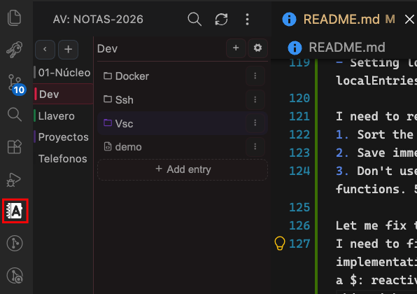
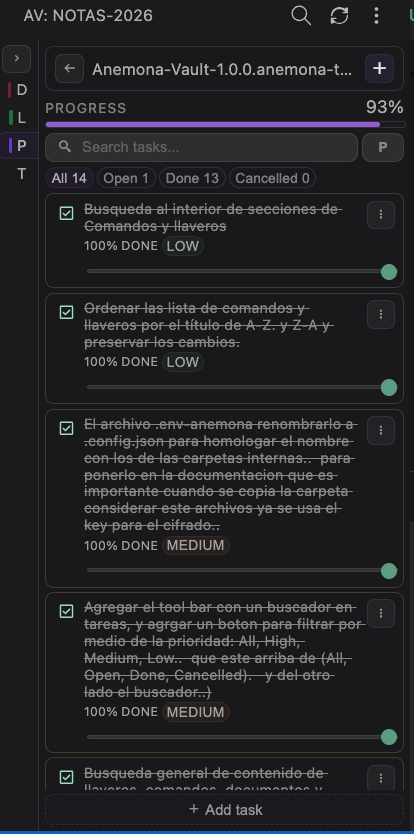

# Anémona Vault

Your developer workspace inside Visual Studio Code.

Organize everything you use every day in one place — notes, secrets, tasks, commands, and code snippets — all accessible from a dedicated sidebar.



## Features

### Note types

| Type | Extension | Icon | Description |
|------|-----------|------|-------------|
| Text | `.md` | 📄 | Free-form markdown notes with search |
| Key | `.anemona-key` / `.anemona-lock` | 🔑 / 🔒 | Encrypted secrets, passwords, API tokens |
| Command | `.anemona-command` | ⌘ | Reusable shell commands with copy |
| Todo | `.anemona-todo` | ☑️ | Task tracking with progress, priorities, and due dates |
| Snippet | `.anemona-snippet` | 📋 | Code snippets with language tagging and copy |




### Vault management

- **Multiple vaults** — Switch between different vault folders from the sidebar
- **Categories** — Group notes into named sections, each with its own color
- **Folders** — Organize notes inside categories with arbitrary nesting
- **Encryption** — Lock/unlock individual key files with a password (AES-256-GCM)
- **Import / Export** — Full vault backup and restore via ZIP
- **Search** — Global search across all note types and categories

### Per-type capabilities

- **Markdown** — Full-text editing with search and highlight
- **Keys** — Add/edit/delete credential entries with title, username, password, email, URL, host, port, token, and notes; copy values to clipboard
- **Commands** — Store and copy shell commands; sort and filter
- **Todos** — Track progress (0–100%), set priority (low/medium/high) and due dates, mark as done/cancelled
- **Snippets** — Store code with language selection (30+ languages), copy code to clipboard, filter and sort

### UX

- **Compact sidebar** — Responsive layout designed for VS Code's narrow sidebar
- **Accent colors** — Per-category color theming
- **Filtering** — Inline filter for each note type's entries
- **Confirmation dialogs** — Code-based delete confirmation to prevent accidental loss

## Storage

All data is stored as plain files on your local filesystem. Choose any folder as your vault root.

```
vault/
├── .config.json             # vault config (encryption key, colors)
├── Notes/
│   ├── .config.json         # category config (color, icon)
│   ├── meeting-notes.md
│   ├── apis.anemona-key
│   ├── deploy.anemona-command
│   ├── ideas.anemona-snippet
│   └── subfolder/
│       └── references.md
└── Projects/
    └── ...
```

## Important

When you copy a vault folder or one of its internal folders, include the `.config.json` file too. That file stores the configuration and the encryption key used to read protected entries.

## Changelog

See [CHANGELOG.md](./CHANGELOG.md).
