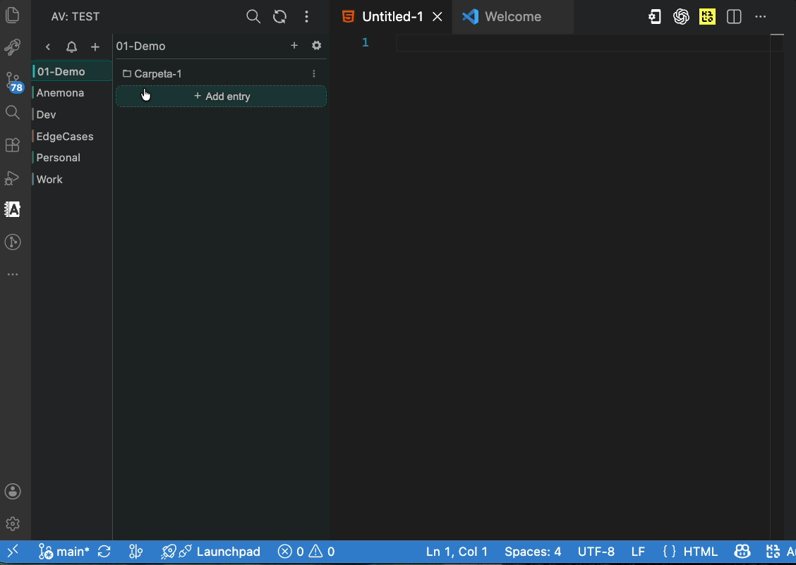
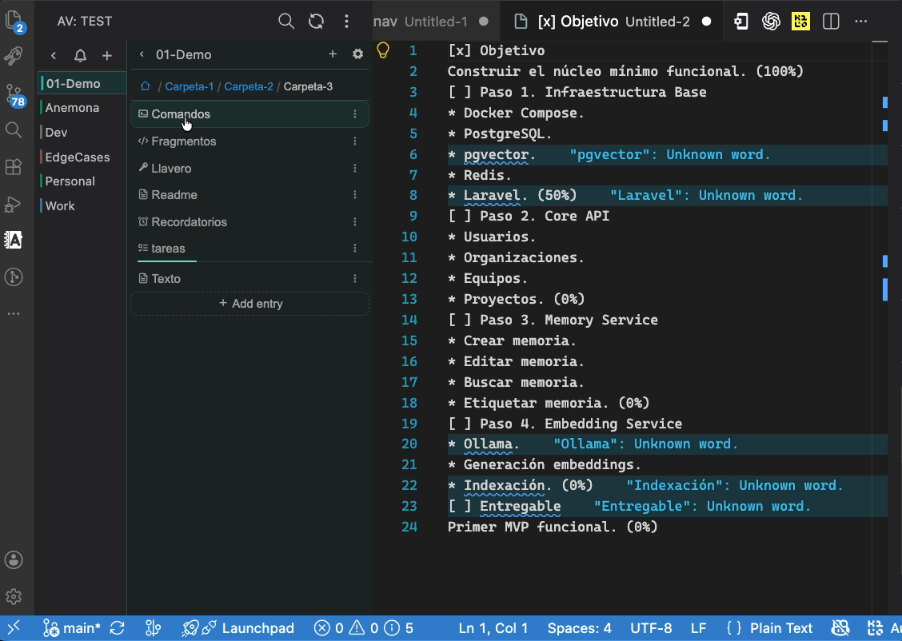

# Anémona Vault

Your developer workspace inside Visual Studio Code.

Organize everything you use every day in one place — notes, secrets, reminders, tasks, commands, and code snippets — all accessible from a dedicated sidebar.

> 🌍 English & Español — full internationalization with auto-detect from VS Code.
> Language selector in the More Actions menu.



## Features

### Note types

| Type | Extension | Icon | Description |
|------|-----------|------|-------------|
| Text | `.md` | 📄 | Free-form markdown notes with search |
| Key | `.anemona-key` / `.anemona-lock` | 🔑 / 🔒 | Encrypted secrets, passwords, API tokens |
| Command | `.anemona-command` | ⌘ | Reusable shell commands with copy and optional documentation |
| Todo | `.anemona-todo` | ☑️ | Task tracking with progress, priorities, and due dates |
| Snippet | `.anemona-snippet` | 📋 | Code snippets with language tagging and copy |
| Reminder | `.anemona-reminder` | 🔔 | Timed reminders with due dates and actions |

### Vault management

- **Multiple vaults** — Switch between different vault folders from the sidebar
- **Categories** — Group notes into named sections, each with its own color
- **Folders** — Organize notes inside categories with arbitrary nesting
- **Encryption** — Lock/unlock individual key files with a password (AES-256-GCM)
- **Search** — Global search across all note types and categories
- **Recent folders** — Quick access to recently opened vaults from the landing screen
- **Persistent view state** — Remembers your selected category, folder, and open note across view switches

### Notifications & Reminders

- **Scheduled notifications** — Automatic reminders for tasks and reminders with due dates (due-soon and overdue)
- **Notification panel** — Dedicated inbox/history panel to review, mark as read, and manage notifications
- **Bell icon badge** — Unread notification count on the Activity Bar and sidebar header
- **Background scheduler** — Periodic checks for due events (configurable interval)
- **Reminder actions** — Attach a file, URL, command, or task action to any reminder
- **Click-to-filter** — Opening a notification pre-filters the editor to show the relevant entry

### Per-type capabilities

- **Markdown** — Full-text editing with search and highlight
- **Keys** — Add/edit/delete credential entries with title, username, password, email, URL, host, port, token, and notes; copy values to clipboard; open external links
- **Commands** — Store shell commands with optional documentation/usage notes; copy, sort, filter, export, and insert directly into the editor
- **Todos** — Track progress (0–100%), set priority (low/medium/high) and due dates, mark as done/cancelled
- **Snippets** — Store code with language selection (30+ languages), copy code to clipboard, filter and sort; insert directly into the editor
- **Reminders** — Add/edit/delete reminders with due date picker (hours/days/weeks/months/specific date), mark as completed, filter by status (All/Pending/Completed), attach actions; automatically sorted — pending first, then by most recent

### Import & Export

- **Vault import / export** — Full vault backup and restore via ZIP with conflict resolution (overwrite all / skip existing)
- **Individual note export** — Export any note as JSON, plain text, or markdown
- **Import from selection or file** — Parse selected text or a picked file into any note type. Recognizes JSON, key:value pairs, code blocks, task lists, and shell commands
- **Cross-vault key import** — Import `.anemona-key` files from another vault with automatic source vault decryption
- **Smart add from selection** — Select text in the editor, click "+" in any note type, and fields are pre-filled automatically

### Navigation & UX

- **Compact sidebar** — Responsive layout designed for VS Code's narrow sidebar
- **Accent colors** — Per-category and per-folder color theming (17 colors)
- **Drag-and-drop** — Move files and folders by dragging them onto a target folder or breadcrumb segment
- **Breadcrumb navigation** — Navigate nested folder hierarchies with clickable breadcrumbs
- **Inline filtering** — Filter entries within each note type editor with sort and priority filters; clear button (×) to reset search
- **Confirmation dialogs** — Code-based delete confirmation to prevent accidental loss
- **More Actions menu** — Quick access to Recent folders, Search, Open folder, Reload, Notifications, Export/Import ZIP, Language, and Settings
- **Reload overlay** — Animated spinner during vault reloads
- **Version notification** — Toast notification when the extension updates, with a link to the changelog

### Internationalization

- **Multi-language support** — English and Spanish included
- **Auto-detect** — Automatically matches your VS Code display language
- **Language selector** — Switch between Auto / Español / English from the More Actions menu

### Configuration

Customize behavior in VS Code settings (`anemona-vault.*`):

| Setting | Default | Description |
|---------|---------|-------------|
| `storagePath` | — | Path where vault data is stored |
| `notifications.enabled` | `true` | Enable notification system for task reminders |
| `notifications.checkIntervalMinutes` | `15` | Interval (min) between scheduled events cache refreshes |
| `notifications.dueSoonHours` | `24` | Hours before due date to trigger a "due soon" notification |
| `notifications.tickIntervalSeconds` | `5` | Interval (sec) between in-memory due checks |

### Note management

- **Rename, move, delete** — Full CRUD for notes, categories, and folders
- **Category colors** — Set or change the accent color for any category
- **Folder colors** — Per-folder accent color override
- **Subfolder config cascade** — Configs merge from vault → category → subfolder, preserving non-overlapping settings

### Iteración 1 — Galería

<table>
  <tr>
    <td width="50%">
      
      <br>
      <em>Drag & drop — move folders between categories</em>
    </td>
    <td width="50%">
      
      <br>
      <em>Commands & snippets — add, edit, and organize</em>
    </td>
  </tr>
  <tr>
    <td width="50%">
      
      <br>
      <em>Snippets & tasks — filter, sort, change status</em>
    </td>
    <td width="50%">
      
      <br>
      <em>Markdown notes & keys — copy passwords with one click</em>
    </td>
  </tr>
  <tr>
    <td width="50%">
      
      <br>
      <em>Tasks — detailed view with progress, priority, and due dates</em>
    </td>
    <td width="50%">
      
      <br>
      <em>Lock — protect key files with a password</em>
    </td>
  </tr>
  <tr>
    <td width="50%">
      
      <br>
      <em>Unlock — open protected key files with your password</em>
    </td>
    <td width="50%">
      
      <br>
      <em>Reminders & notifications — due dates, actions, and alerts</em>
    </td>
  </tr>
</table>

## Storage

All data is stored as plain files on your local filesystem. Choose any folder as your vault root.

```
vault/
├── .config.json             # vault config (encryption key, colors)
├── Notes/
│   ├── .config.json         # category config (color, icon)
│   ├── meeting-notes.md
│   ├── apis.anemona-key
│   ├── deploy.anemona-command
│   ├── ideas.anemona-snippet
│   ├── weekly.anemona-reminder
│   └── subfolder/
│       └── references.md
└── Projects/
    └── ...
```

## Important

When you copy a vault folder or one of its internal folders, include the `.config.json` file too. That file stores the configuration and the encryption key used to read protected entries.

## Changelog

See [CHANGELOG.md](./CHANGELOG.md).
